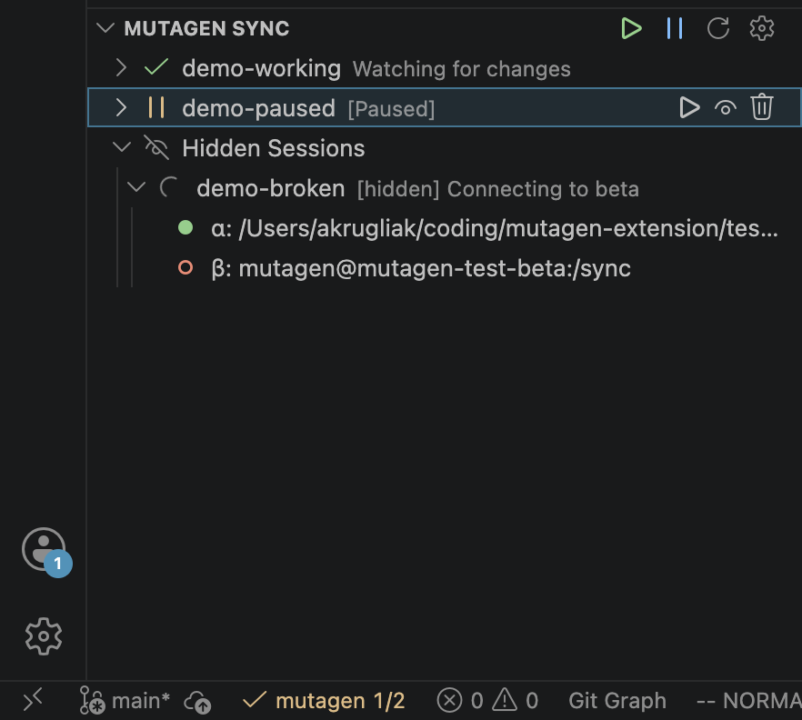
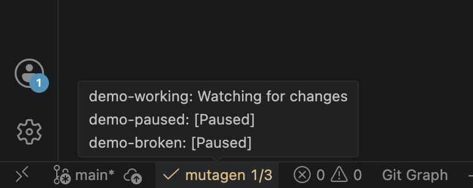
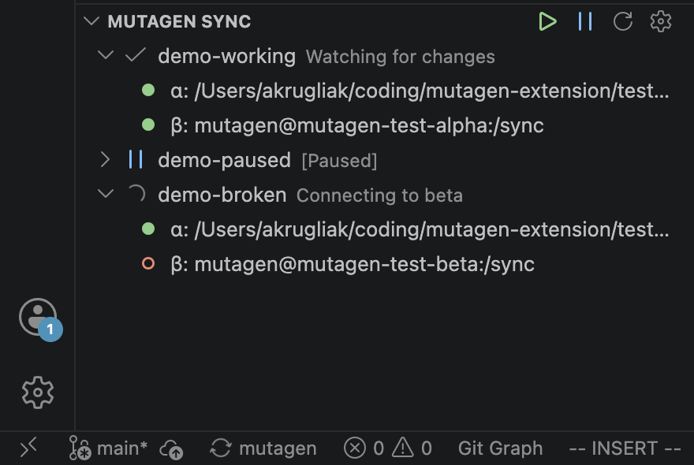

# Mutagen Sync — VSCode Extension

Monitor and control [Mutagen](https://mutagen.io) sync sessions directly from VSCode.

[](https://marketplace.visualstudio.com/items?itemName=ksemele.mutagen-sync)

## Features

- **Status bar** — shows session health at a glance; click to open the panel
- **Explorer panel** — all sessions with expandable details (endpoints, connection state, errors)
- **Inline controls** — Pause / Resume / Flush per session; trash icon to permanently terminate
- **Bulk actions** — Pause All / Resume All from the panel toolbar
- **Auto-refresh** — every 10 seconds (configurable)
- **Hidden sessions** — hide sessions from the main list without terminating them

## Screenshots


*You can hide some sessions - then mutagen-sync will watch only the needed ones (affect status bar colors and counts)*


*Statusbar shows all syncs on hover*


*You can disable some colors in the settings and more*

## Requirements

Mutagen must be installed and the daemon must be running before the extension activates.

### macOS (Homebrew)

```bash
brew install mutagen-io/mutagen/mutagen
mutagen daemon start
```

Full installation guide: [mutagen.io](https://mutagen.io) · [GitHub releases](https://github.com/mutagen-io/mutagen/releases)

## Settings

| Setting | Default | Description |
|---|---|---|
| `mutagen.refreshInterval` | `10` | Status refresh interval in seconds (minimum 3) |
| `mutagen.binaryPath` | `""` | Path to the mutagen binary (empty = auto-detect from PATH) |
| `mutagen.showSessionCounts` | `true` | Show healthy/total count in the status bar (e.g. `✓ mutagen 2/3`) |
| `mutagen.statusBarColorByStatus` | `false` | Tint the status bar text: green / yellow / red by session state |
| `mutagen.coloredIcons` | `true` | Use colored icons in the session tree view |
| `mutagen.alphaLabel` | `α` | Label for the alpha endpoint in tree view tooltips |
| `mutagen.betaLabel` | `β` | Label for the beta endpoint in tree view tooltips |
| `mutagen.confirmTerminate` | `true` | Ask for confirmation before terminating a session (termination is permanent and cannot be undone) |

Open settings: **Cmd+,** → search `mutagen`, or click the gear icon in the Mutagen Sync panel.
